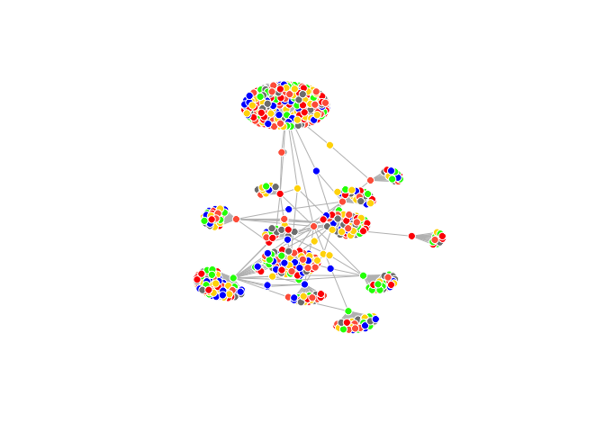

A3 Network Visualization
================
Rodrigo Valdes Ortiz
5/28/2018

``` r
nodes <- read.csv("./data/nodes.csv", header=T, as.is=T)
links <- read.csv("./data/edges.csv", header=T, as.is=T)

links <- aggregate(links[,3], links[,-3], sum)
links <- links[order(links$from, links$to),]
colnames(links)[3] <- "weight"
rownames(links) <- NULL
```

``` r
net <- graph_from_data_frame(d=links, vertices=nodes) 
```

``` r
# Generate colors based on media type:
colrs <- c("tomato", "gray50", "gold", "blue", "red", "green")
V(net)$color <- sample(colrs, 708, replace = TRUE) 

# Setting labels to null:
V(net)$label <- NA

plot(net, edge.arrow.size=.01, edge.color="grey", vertex.frame.color="#ffffff", vertex.size = 6,
     layout=layout_nicely)
```



**Story**

When you create networks of citations, there are two ways of defining the membership of a paper in one academic field. First, you can use the classification provided by an external provider. Second, you can run a community detection algorithm to create clusters, each of this clusters is one academic field, by definition. For example, the Web of Science provides a classification of papers by subject. However, the structure of science, according to the ties among papers can differ from the classification provided by the Web of Science.

I propose a visualization to show the conflict between these two approaches. In order to show this, I color the nodes with the classification provided by the database. In addition, I show associations among papers in the graphs using the layout "nicely" in igraph as a proxy of clusters created with a community detection algorithm.

Interpretation of the graph: if we find a community of articles which papers are colored in the same color, the database classification is similar to the ties among its papers. However, if the observed clusters are multicolor, then, the classification of the database does not agree with the ties among its papers.

**Why this graph?**

This data is about the ties among papers. Then, network visualizations are the best approach to depict how these articles are related to each other.

**Challenges**

First, transform the data to be able to use it as a network in R. I did all the data management in Python 3.6.

Second, I started using ggraph, however, the scarce tutorials and documentation were confusing and outdated. The tutorials do not agree with the version that I installed from CRAN. The main issue was how to color the nodes as I needed. Then, I changed to igraph.

Third, the networks of citations can be quite big, which does not allow easy visualizations. Then, one of the goals was to create a small subsample that portrays something interesting.

Fourth, the data of the subsample that I selected did not have all the data necessary for this visualization (the labels by academic discipline). Then, I needed to create synthetic data to finish this assignment.

**Note:**

The data about cites is authentic, however, the labels by subject are synthetic data.
